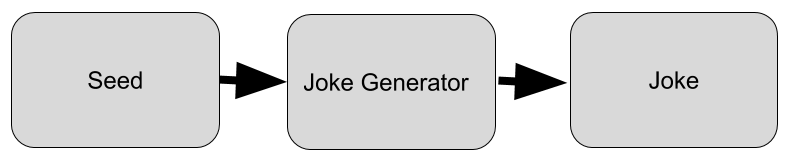
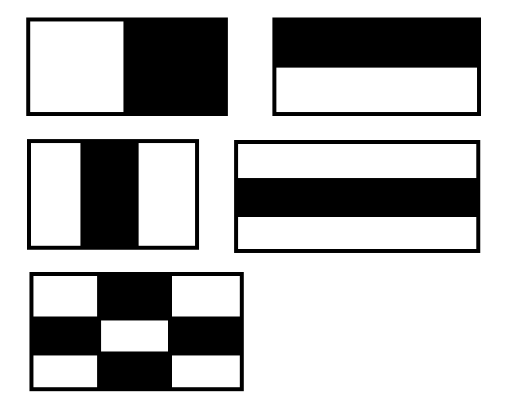

# Joke Generator GAN with LSTM  
## 1. Introduction and Problem Statement

1. Joke Generation is complicated task for computers that requires deep understanding of
language, grammar and context. Current Joke Generation implementations are usually
based on LSTM (Long Short Term Memory) networks[1]. LSTM are generally good
for sequence and sequence forecasting. Moreover, LSTM can learn inherent structure
and context of dataset. We will try to improve this design by wrapping LSTM around
Generative Adversarial Networks (GAN). The main idea is that LSTM will be used to
generate jokes and Discriminator will be used to distinguish between real and generated
jokes. Feedback from Discriminator will be used improve LSTM. In the end, this comes
down to min-max game between Generator (LSTM) and Discriminator. There is already
some work done in this area[2], but the application of it in context of joke generation does
not exist yet. There are 2 versions of the implementation of the project. One is the LSTM
with the character based generation and the second one is the LSTM with GAN. The main
drawback with the GAN is that it takes lots of time to generate correct sequences and
show good result. Two implementations will be compared and the efficient one will be
chosen for the project. It also may learn from previous experiences and modify according
to the data which jokes better suits the current user. Data provided from sensors will
be processed, by achieving high accuracy and efficiency it would manage 2-5 minutes
happiness of the user.


2. The project will have lots of useful applications in the real life. Possible application of
the project may be in implication for robot empathy, for advertisement in websites and
in human mental support machines/websites/programs. It could also help chatbots and
virtual assistants to generate a humour for their users on an individual basis[3]. Chat
bots usually use templates to respond. Chatbots and virtual assistants feel more human-
like to their users if they can understand and generate humor[3]. Humor requires complex
functions like empathy, spontaneity, and linguistic subtlety, etc[4]. Also, one application of
our project is in the advertisement. In advertising, a brand can connect with audiences and
possible buyers through a different creative strategies[5]. However, the efficient strategy is
offering the humorous advertisements. With humorous advertisement sellers can closely
connect with audiences and increase the sells[6].
One of the applications of the project is the real-time smile detection of potential users
which has been integrated to the project. It the example of the applications in human
computer interaction (HCI). The main aim of the application was to obtain the feedback
of the humor generator, to improve the quality of the generated jokes and analyze how
machine learns and improves empathy, in particular, humor generation. Computer vision
OpenCV library with python IDE and haar-like features was combined to achieve the
required performance in a real time smile detection app.

3. At the end quality of generated jokes could assessed by some variant of Turing test.
Given highly subjective nature of humour generation, this will be a good final metric. If
users could not distinguish between synthetic and human-made jokes generator could be
considered successful. However, while training resubstitution based error estimation suits
better for our purpose because in our case we do not need very accurate error estimation
and resubstitution is computationally more effective than other more accurate methods
such as bootstrapping, leave-one-out and etc.

4. Our aim is to generate the sequences of words that will comprise joke. Given seed generator
should be able to generate joke (Figure 1) Seed can be any random number or just the
beginning of the word.The joke generator tries to generate new jokes based on the input
seed.

|  | 
|:--:| 
| *Figure 1: Generator work flow* |

## 2. Database
This database contains short 231,657 jokes in a csv format. Joke length varies from 10
characters to 200 characters. For every line of joke the unique ID number is attached. The
type of data contained in this database can be classified as linguistic and sequential. As was
mentioned in problem statement we will try to generate new jokes that are inspired by jokes in
our database. The challenge is to generate semantically meaningful, grammatically correct and
funny jokes which is the complex task.
Need to mention that even the process of data collection and parsing seek to obtain clean
and funny jokes, it has some limitation and the disclaimer. Complexities in working with
database were due to specific vocabulary and high dimensionality of the database, which can be
observed from Figure 2. Jokes are funny in terms of some specific context, inherently dealing
with database the problem of context comprehension occur. Due to the fact that the data
was collected, scraped and parsed from websites, few jokes appeared to be inappropriate and
offensive.
Every word was processed on a character level. Each character was represented as one hot
encoded vector, which implies that all entries are zero, except one which position corresponds
to a character. There were in total 70 characters including spaces, special symbols, numbers,
and lower-cased Latin alphabet (in order to reduce dimensionality and number of training
parameters). Need to mention that as our aim is to generate the sequences of words, that is
why the whole data was taken as the training set.

## 3. Neural network architecture
For this project two version of generation algorithm were implemented, namely vanilla LSTM
generation as a baseline and GAN with LSTM inside. Vanilla LSTM network is comprised of
two layers, first is recurrent LSTM layer and second layer is densely connected with softmax
activation function. The letters were encoded by one-hot principle, which works well with
softmax activation function. As a input it takes time series of fixed length, where each time
steps encodes single letter in sentence. As a output this network tries to predict next letter and
a resulting mismatch between actual label and predicted is used to calculate loss. The type of
loss that is applicable for this problem is categorical cross-entropy with RMSprop optimizer.
The architecture and training of GAN networks (Figure 3) is more complex compared to
the LSTM. As it is basically comprised of two distinct networks (Generator & Discriminator).
Generator itself consist of several different layers, where first layer is densely connected and as
an input it takes sample from latent space and encodes it for usage in consequent layers. Second
and third layers are stateful LSTMs which are then wrapped by time distributed dense layer. As
result the whole character sequence is produced at once (which looking retrospectively was bad
design decision as it significantly increases training complexity) and can be fed to discriminator.
In contrast Discriminator is quite simple and has commonalities with vanilla LSTM. Similar to
vanilla LSTM it consist from LSTM layer followed by dense layer. However, number of output
neuron is reduced to one and activation was chosen to be sigmoid instead of softmax, because
of binary (Synthetic or Real) classification nature of this problem.

## 4. Theory
Recurrent neural networks(RNN) are networks with loops[7]. LSTM is one type of the RNN
which is efficient for many tasks. They can learn long-term dependencies[8]. LSTMs are efficient
for problems associated with long-term dependency. LSTMs networks are in the form of a chain
of repeating modules of neural network. They have four neural network layer.
Generative Adversarial Networks(GAN) takes up a game-theoretic approach[9]. The net-
work learns to generate using a 2-player game. The two parts are Generator and Discriminator.
They are in constant competition during the training process. The role of a generator is to
generate correct jokes and the discriminators role is to identify which one of them are bad and
incorrect. They are in constant competition with each-other as generator tries to deceive the
discriminator, while the other tries not to be tricked. To generate the best jokes we need a very
good generator and a discriminator. When the generator is not good , the discriminator will
not be tricked. If the discriminator is good, then incorrect jokes will be classified as fake and the
model trains well and the desired output will be produced. The input is a random noise that
can be classified as a Gaussian distribution and values can be sampled from this distribution
and fed into the network and jokes are generated. Generated jokes are compared with a real
ones by the discriminator and it tries to find if they are fake or real. Objective function is a
minmax function. Because of a game-theoretic approach, the objective function is in the form
of a minmax function[10]. The discriminator acts to maximize the objective function and it is 
performed as a gradient ascent on the objective function. The generator acts to minimize the
objective function and it is performed as a gradient descent on the objective function. The the
network can be trained by changing between gradient ascent and descent.

## 5. Algorithm and code
### 5.1. Vanilla LSTM generator
In the nutshell, vanilla LSTM takes 40 letters as an input and tries to predict next one and
this can be done recursively, which allows continuous text generation. Letters are represented
as a one-hot encoded vector and fed to the network as a time series with fixed length (specifies
by maxlen variable, in our case it was 40). The number of hidden neurons in LSTM cell was
chosen to be 128, because it roughly two times a length of one-hot encoded vector and works
well. Categorical accuracy metrics allows us to see how often LSTM makes correct prediction
while training. [11]

```{python}
model = Sequential()
model.add(LSTM(128, input_shape=(maxlen, len(chars))))
model.add(Dense(len(chars)))
model.add(Activation('softmax'))
optimizer = RMSprop(lr=0.01)
model.compile(loss='categorical_crossentropy', 
              optimizer=optimizer,
              metrics=['categorical_accuracy'])
```

### 5.2. GAN LSTM
Generator & Discriminator are needed to be trained in tandem and that’s why training process
could easily become unstable. Moreover, GAN training is more computationally expensive
because in order to give meaningful results it needs to learn significant part of latent-space to
sequence mapping. Figure 3 shows general procedure that was used to train our network. In
those figures green color is used to show which layer is currently training target while blue color
signifies that weight of this layer is frozen during this training round. Red color represents
error, which in our case means number of missclassified jokes (synthetic jokes labeled as real
and vice versa) compared to total number of samples. So training procedure can be summarized
as following:
1. In order to train discriminator latest iteration of generator was used to generate several
number of synthetic jokes, which afterword are mixed up with actual human made jokes
and the job of discriminator is to distinguish them (Figure 3 left). Due to the fact that
discriminator is binary classifier, binary crossentropy loss with adam optimizer was used
in order to update its weights.


```{python}
def train_dis(self, nbatch=10, sentence_len = 5):
  # number of training rounds
  for cnt in range(nbatch):
    # sample from Gaussian distribution
    gen_noise = np.random.normal(0, 1, (sentence_len, self.input_shape[0]))
    # generate synthetic text
    synthetic_text = self.G.predict(gen_noise)
    # takes samples from actual dataset
    legit_text = self.take_samples()
    # put them into the batch
    x_combined_batch = np.concatenate((legit_text, synthetic_text))
    # label 1: actual text, label 0: synthetic text
    y_combined_batch = np.concatenate((np.ones((sentence_len, 1)),
                                       np.zeros((sentence_len, 1))))
    # train discriminator on current batch
    d_loss = self.D.train_on_batch(x_combined_batch, y_combined_batch)
    print (f'dis_epoch: {cnt}, [Discriminator: d_loss: {d_loss[0]}]'
  # return loss value of a last round
  return d_loss[0]
```

2. In order to train generator latest iteration of discriminator is frozen and we feed it with
synthetic sequence only. The main trick is that we assume label of this synthetic sequences
to be true and as a result generator will learn how to modify itself in order to outsmart
discriminator [12]. This is not disrupting Discriminator because its weights were frozen
in advance.

```{python}
def train_gen(self, nbatch=1000, sentence_len = 5, save_interval = 100):
  # number of training rounds
  for cnt in range(1, nbatch+1):
    # sample from Gaussian distribution
    noise = np.random.normal(0, 1, (sentence_len, self.input_shape[0]))
    # label synthetic text as real
    y_mislabeled = np.ones((sentence_len, 1))
    # train generator, weights of the discriminator are frozen
    g_loss = self.stacked_generator_discriminator.train_on_batch(noise, y_mislabeled)
    print (f'gen_epoch: {cnt}, [ Generator : g_loss: {g_loss}]')
    if cnt % save_interval == 0:
      # generate and print examples
      self.generate_test()
  # return loss value of a last round
  return g_loss
```

3. The steps 1 and 2 are followed one after another until network is converges and training
time for each step is dynamically allocated depending on loss. For example, generator
is generally harder to train therefore it will be beneficial to train for longer time, but
manually fixing training time is not efficient. Therefore, depending on loss value training
time is increased or decreased. The main aim is to train generator that could consistently
produce good samples.

```{python}
def train(self, epochs=2000, sentence_len = 5, save_interval = 10,
           ndis=100,ngen=1000, gsave_interval=100,
           gtresh=1 ,dtresh=0.5):
    # minimal number batches for generator and discriminator
    gmin = ngen
    dmin = ndis
    # number of epochs
    for cnt in range(1, epochs):
      # train discriminator
      d_loss = self.train_dis(nbatch=ndis, sentence_len=sentence_len)
      # train generator
      g_loss = self.train_gen(nbatch=ngen, save_interval=ngen//2)
      # if loss is greater than specified threshold, 
      # increase number of rounds for generator
      if g_loss > gtresh:
          ngen+=10
      else:
          # do not decrease beyond minimal
          if ngen > gmin:
            ngen-=10
      # if loss is greater than specified threshold, 
      # increase number of rounds for discriminator
      if d_loss > dtresh:
          ndis+=10
      else:
          # do not decrease beyond minimal
          if ndis > dmin:
            ndis-=10
```

### 5.3. Haar feature-based cascade classifier
Haar feature-based cascade classifier is effective for smile detection. It was proposed by
Paul Viola and Michael Jones in their paper named as Rapid Object Detection using Boosted
Cascade of Simple Features[13]. At first to train the classifier the algorithm requires many
images of people with smile and images of people without smile. By the algorithm the best
features will be extracted from the trained samples. In order to do that, Haar features depicted
on the Figure 4 are used, where each feature is the value obtained by subtraction sum of the
pixels under white area and sum of pixels under black area.


|  | 
|:--:| 
| *Figure 4. Haar-like features* |

To find required quantity of features using kernels, integral images technique was applied to
minimize the calculation. This process makes Haar feature-based cascade classifier to operate
fast. Another modification used in classification is the Adaboost algorithm to select relevant
feature combinations[14]. In the Adaboost algorithm weak classifiers based on haar-like features
will be chosen and they form a combination. As a result, strong classifier formed from weak
classifier combination for smile detection is found. In this technique Haar features are applied
to all training images, and for each feature the threshold values classifying smiling faces are
found. The features with minimum error rate was chosen for classification. Initially each image
has equal weight values, weights of misclassified imaged are increased after every classification
process. This process done in iterative way until required accuracy is attained and optimal
number of features resulting in this accuracy is selected.

OpenCV and Python IDE was integrated for smile detection to operate in real time. In
order to process the video or image in real time it was analyzed frame by frame and converted
into gray scale. Fluctuations in illumination cause problems in real time smile detection.
Firstly, face detection takes place and only after that smile detection process will be acti-
vated. Face detection is done by scanning the image and extracting differentiating patterns of
the face. It is allocated on the picture by sub-window. By completing the above-mentioned
steps, Haar-Like Feature function from OpenCV is implemented to built the prototype of the
application [15]. Even there are many sophisticated versions of the Haar feature-based cascade
classifier with OpenCV[16], the simple one was implemented in this project. Because the main
aim of the project was to generate the jokes. Further work might include improvement in both
generation of the jokes and in creation of the novel techniques.


```{python}
# For every incoming frame
smile_detected = False
# convert frame into gray-scale for optimization 
gray = cv2.cvtColor(frame, cv2.COLOR_BGR2GRAY)
# returns list of detected faces based on haar cascade
faces = faceCascade.detectMultiScale(gray, scaleFactor= 1.05,
	                                 minNeighbors=8, minSize=(55, 55),
	                                 flags=cv2.CASCADE_SCALE_IMAGE)
# coordinates of faces
for (x, y, w, h) in faces:
    # draw rectangle around a face
    cv2.rectangle(frame, (x, y), (x+w, y+h), (0, 0, 255), 2)
    roi_gray = gray[y:y+h, x:x+w]
    roi_color = frame[y:y+h, x:x+w]
    # looks for smile on the face using haar cascade
    smile = smileCascade.detectMultiScale(roi_gray, scaleFactor= 1.7, 
                                          minNeighbors=22, minSize=(25, 25),
                                          flags=cv2.CASCADE_SCALE_IMAGE)
    # set smile_detected flag
	if len(smile) > 0:
		smile_detected = True
	# draw rectangle around a smile if exist
	for (x, y, w, h) in smile:
		cv2.rectangle(roi_color, (x, y), (x+w, y+h), (255, 0, 0), 1)
# if 'sad' person is looking display joke 
if not smile_detected and len(faces)>0:
	display_joke(frame)
# if no one is watching keep current state
elif len(faces)==0:
	pass
# is person is smiling stop joke generation
else:
	generated = ''
# display frame for user
cv2.imshow('frame',frame)
```


## 6. Performance evaluation
At the end, baseline LSTM model provided better generation quality relative to LSTM-
GAN. Baseline model can generate long and phonetically coherent sequences with acceptable
grammar. However, context and meaning of jokes is not captured by this model and resulting
jokes are incoherent sequence of word with common theme as can be seen from examples 1 & 2.
Example 1. Stick, so I just started eating it so I went a bar white a said men I was a ban a
chalice one the clifest on the body of the body.
Example 2. My friend the truck into a bar the bashe the day when I was a girl when they
hear the clubs in a bar...
In contrast, LSTM-GAN is more complex model and requires long training time. Our model
tries to generate whole sequence through only one forward pass and as a consequence the longer
is a sequence the longer time it takes to explore latent space and to converge. However, even for
very short sequences (less than 10 letters) LSTM-GAN could not generate meaningful result.
The main possible reason for this is that even for short sequences it takes very long time to
train and converge due to bad design decision. To be more specific, it is most probably due
to the fact that we chose to generate whole sequence in one go and this makes training more
unstable, requires higher number of tunable parameters.
Created application functions well in real time, detects the smile on the faces with high
accuracy. It generates jokes when the smile is not detected on the users face and does not when
vice-versa. The achieved frames per second rate is comfortable for users. Slight modification is
needed the processing of the photos with poorly lit room, because it does not attain accuracy
in smile detection.


## 7. Conclusions
To sum up, two distinct architectures for joke generation were implemented with different
amount of success. Both LSTM with character based generation (vanilla LSTM) and LSTM
with GAN were implemented and the results of them were compared. At the end simpler
architecture (vanilla LSTM) has shown better performance and generation quality relative to
the more complicated LSTM-GAN. For this project vanilla LSTM is chosen to be the efficient.
The project is important in terms of its applications as it can have lots of useful and beneficial
applications. The initial objective of the project has been partially achieved. In the future,
there will be further improvement of both architectures